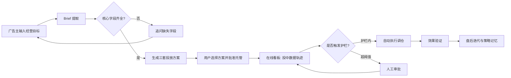
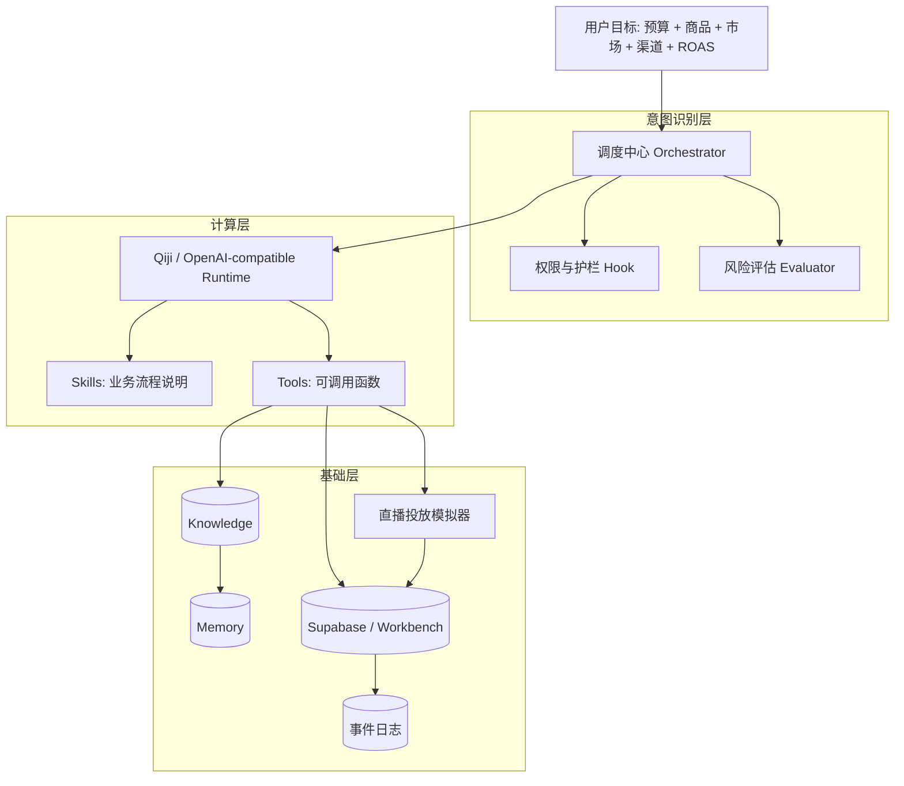
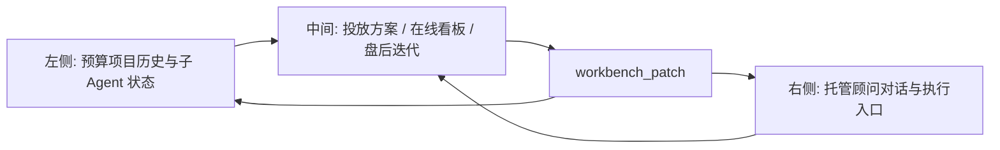
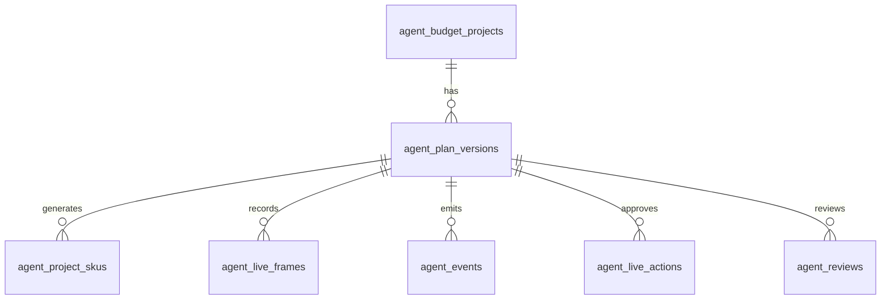
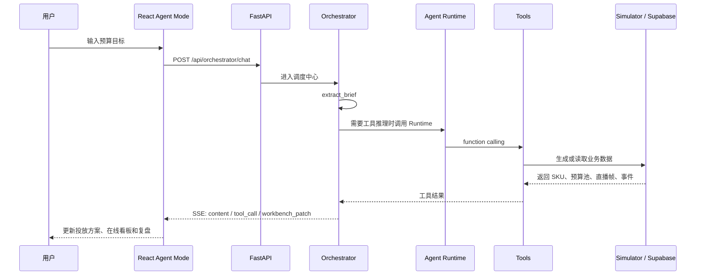

# MaiDeal 工作台

MaiDeal 工作台是面向出海直播电商的 Agent Native 投放托管 Demo。它把广告主的一句话经营目标转成可执行的预算项目，并围绕投放方案、在线看板、盘后迭代三段流程完成 Agent 编排、工具调用、数据模拟、审批护栏和复盘沉淀。

当前主线是 `/agent-mode`：用户输入预算、商品、市场、目标 ROAS、渠道和预算比例后，调度中心会提取 Brief，生成三套投放方案，启动直播投放模拟，并把每一帧预算消耗、GMV、ROAS、库存、SKU 表现、事件和复盘写成可追溯的数据状态。

## 一句话定位

MaiDeal 工作台不是传统广告后台，而是一个投放经营 Agent：

- 用户用自然语言描述目标。
- Agent 拆解目标、调用工具、生成方案。
- 模拟器在没有真实投放数据时生成一致的数据轨迹。
- 护栏机制决定哪些动作自动执行，哪些动作需要人工审批。
- 复盘模块把投放过程、关键动作、线索资产和增量收益沉淀为下一轮策略记忆。

## Agent Mode 演示路径

访问：

```text
https://agent-hackthon.680728.xyz/agent-mode
```

典型输入：

```text
我要给便携榨汁杯做一场美国市场直播，预算 10000 美元，目标 ROAS 5.0，
投放 amazon, facebook, tiktok 三个渠道，预算占比分别是 30%，25%，45%
```

也可以输入：

```text
我要给可达鸭做一场英国市场直播，预算 20000 美元，目标 ROAS 3.0，
投放 tiktok 1 个渠道
```

系统会完成：

1. 提取预算项目 Brief。
2. 判断字段是否齐全，缺渠道时追问。
3. 生成 5 个 SKU 的模拟商品库。
4. 按用户输入渠道生成预算池。
5. 输出保守、均衡、进取三套投放方案。
6. 启动直播托管轨迹，预算消耗单调递增直到花完整笔预算。
7. 根据每帧数据计算收入、ROAS、毛利润、库存和 SKU 投放表现。
8. 产生事件时间线、告警、审批动作和盘后复盘。

## 产品流程



## Agent 分层设计



当前实现中，用户只和一个“托管顾问”交互。内部由多个子 Agent 角色协作：

| 子 Agent | 职责 |
| --- | --- |
| 调度中心 | 识别阶段、抽取 Brief、组织工具、校验护栏 |
| 方案规划 | 生成保守、均衡、进取方案和预算拆分 |
| 投放执行 | 执行预算调仓、降速、加码、暂停等动作 |
| 效果分析 | 识别 ROI、CPA、库存和渠道变化并归因 |
| 经营信号 | 汇总评论、点击、加购、线索和外部经营线索 |

## `/agent-mode` 页面结构



三段工作区：

- 投放方案：展示渠道/直播间列表、三种策略模式、预算护栏和确认托管入口。
- 在线看板：展示模拟直播过程中的预算池、SKU 投放、收入、ROAS、库存、事件和审批。
- 盘后迭代：展示固定预算基线、Agent 托管实际、增量收益、关键动作、线索资产和下一场策略草案。

## 数据关系模型



核心表：

| 表 | 作用 |
| --- | --- |
| `agent_budget_projects` | 预算项目主记录，包含商品、市场、预算、目标 ROAS、渠道和状态 |
| `agent_plan_versions` | 每次生成方案都保存一个版本，不覆盖旧版本 |
| `agent_project_skus` | 模拟商品库，每个方案默认生成 5 个 SKU |
| `agent_live_frames` | 直播轨迹帧，记录每分钟指标、预算池、SKU、步骤和告警 |
| `agent_events` | 事件时间线，和审批、调仓、预警保持一致 |
| `agent_live_actions` | 待审批、已批准、已拒绝、已执行的投中动作 |
| `agent_reviews` | 盘后复盘，包含实际 ROAS、基线对比、关键动作和 API trace |

指标关系：

```text
成交 GMV = sum(SKU GMV)
实时 ROAS = 成交 GMV / 广告投流费用
毛利润 = 成交 GMV - 广告投流费用
库存 = 初始库存 - 已售件数
渠道预算池总额 = 用户输入总预算
最终帧累计消耗 = 用户输入总预算
```

## Agent 工具与技能目录

当前 Agent 相关代码已经集中到 `backend/agent/`：

```text
backend/agent/
├── registry.py                 # 工具注册表，输出 OpenAI-compatible function schema
├── runtime.py                  # 加载 skills，构建系统提示词
├── runtime_runner.py           # Qiji / OpenAI-compatible 多轮工具调用运行器
├── tools/
│   ├── model_estimation.py     # 流量和 ROI 预估
│   ├── database_query.py       # 后台数据安全查询
│   ├── content_generation.py   # 图文物料和小红书草稿生成
│   ├── budget_allocator.py     # 预算分配模型
│   ├── media_platforms.py      # 媒体 RTA / RTB 接入信息
│   ├── external_knowledge.py   # 外部经营线索检索和记忆沉淀
│   └── simulator.py            # 直播托管模拟器工具入口
├── skills/
│   ├── budget-allocation/
│   ├── business-knowledge/
│   ├── content-publishing/
│   ├── live-simulator/
│   └── media-rta-rtb/
├── knowledge/                  # 外部搜索原始知识
├── memory/                     # 提炼后的经营记忆
└── logs/                       # Agent 工具运行日志
```

已经注册的工具：

| 工具 | 说明 |
| --- | --- |
| `estimate_ad_performance` | 结合推荐系统思路估算点击、GMV、ROI 和推荐理由 |
| `query_backend_database` | 通过 allowlist 查询工作台和 Supabase 数据 |
| `generate_marketing_content` | 使用 Qiji `gpt-image-2` 生成图片提示、标题、文案和发布包 |
| `allocate_budget` | 在线性预算约束和 ROI 预估下分配渠道预算 |
| `inspect_media_api` | 梳理巨量、千川、小红书聚光等媒体 API/RTA/RTB 接入路径 |
| `refresh_business_knowledge` | 通过 Xiaosu/Cloudsway 搜索经营线索，并写入 knowledge/memory |
| `simulate_live_workbench` | 在无真实投放数据时生成完整投放轨迹 |

## 后端调用链



关键接口：

| 接口 | 作用 |
| --- | --- |
| `POST /api/orchestrator/chat` | 主对话入口，返回 SSE |
| `GET /api/agent-mode/workbench` | 读取当前工作台 |
| `PUT /api/agent-mode/workbench` | 更新轻量工作台状态 |
| `POST /api/agent-runtime/run` | 独立 Agent runtime，支持读取 skills 和调用工具 |
| `GET /api/agent-runtime/tools` | 查看已注册工具 |
| `POST /api/workbench/reset` | 重置工作台 |
| `GET /api/workbench/state` | 调试读取完整工作台状态 |

## 关键代码结构

```text
agent-hackthon/
├── frontend/
│   └── src/
│       ├── agent-mode/
│       │   ├── AgentModePage.jsx       # Agent Mode 主工作台
│       │   └── agentModeDefaults.js    # 前端默认状态和演示数据边界
│       ├── agent-loop/
│       │   └── AgentLoopPage.jsx       # 通用 Agent Loop 页面
│       ├── manual-workbench/
│       │   └── ManualWorkbenchPage.jsx # 传统人工后台对照页
│       └── services/api.js             # REST 与 SSE API 封装
├── backend/
│   ├── api.py                          # FastAPI 路由
│   ├── orchestrator.py                 # 业务调度中心
│   ├── agent_mode_simulator.py         # 投放数据模拟器
│   ├── agent_mode_repository.py        # Supabase/内存持久化边界
│   ├── agent_mode_store.py             # fallback 工作台
│   └── agent/                          # 工具和技能层
├── supabase/migrations/
│   └── 20260627170000_agent_mode_persistence.sql
├── docs/
│   ├── hackathon-growengine-agent-plan.md
│   ├── hackathon-server-deployment-guide.md
│   └── plans/growengine-global-image-text-agent-plan.md
└── tests/
    ├── test_agent_mode_frontend.py
    ├── test_agent_mode_simulator.py
    ├── test_agent_mode_repository.py
    ├── test_agent_runtime_runner.py
    ├── test_agent_tool_registry.py
    └── test_live_loop_orchestrator.py
```

## 模拟器设计

`backend/agent_mode_simulator.py` 负责在没有真实媒体和交易数据时，生成可演示、可复现、关系一致的数据图。

输入：

- 商品
- 市场和币种
- 总预算
- 目标 ROAS
- 投放渠道与比例
- 直播时间
- 约束条件

输出：

- 5 个 SKU 的商品库。
- 渠道预算池。
- 三套投放方案。
- 多帧直播轨迹。
- 事件时间线。
- 审批动作。
- 盘后复盘。

约束：

- 同一 Brief 使用确定性 seed，便于复现。
- 累计消耗单调递增。
- 最终帧消耗等于总预算。
- 缺渠道时不生成方案，而是由 Agent 追问。
- 审批动作、事件时间线和看板告警保持一致。

## 本地运行

后端：

```bash
cd backend
python3 -m venv venv
source venv/bin/activate
pip install -r requirements.txt
uvicorn api:app --reload --host 0.0.0.0 --port 8000
```

前端：

```bash
cd frontend
npm install
npm run dev
```

访问：

```text
http://localhost:5173/agent-mode
```

## Docker 部署

```bash
cp .env.hackathon.example .env.hackathon
docker compose --env-file .env.hackathon -f docker-compose.hackathon.yml up -d --build
```

前端容器会通过 Nginx 托管静态资源，并把 `/api` 和 `/health` 代理到后端容器。

## 测试与验证

后端和行为测试：

```bash
python3 -m unittest discover tests -v
```

前端构建：

```bash
cd frontend
npm run build
```

线上验证：

```bash
curl -I https://agent-hackthon.680728.xyz/agent-mode
```
