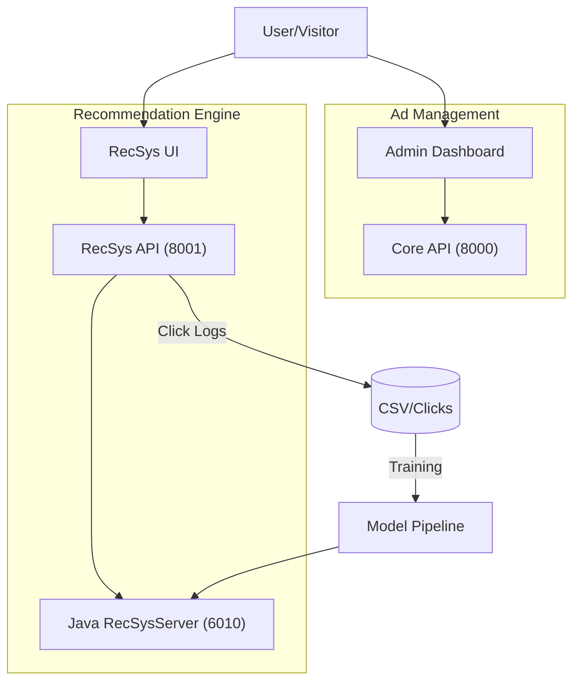

# GrowEngine 🚀

[](LICENSE)
[]()


**[中文文档](README_CN.md)**

GrowEngine is a comprehensive advertising automation platform evolved to include a **Hybrid Recommendation System**. It combines a robust ad campaign management dashboard with an experimental, high-performance recommendation engine integrated from SparrowRecSys.

## ✨ Features

### 🏢 Core Platform
- **📊 Real-time Dashboard**: Monitor Spend, GMV, ROI, and core metrics instantly.
- **📋 Campaign Management**: Full lifecycle management for ad plans (Create, Edit, Pause/Resume).
- **🤖 Smart Diagnosis**: AI-driven optimization suggestions for ad performance.
- **🎮 Bidding Simulation**: Simulate bidding strategies based on OnlineLp algorithms.

### 🎯 Hybrid Recommendation System (New)
Integrated directly with **SparrowRecSys**, offering a "Hybrid Mode" architecture:
- **Python Backend**: Handles Data Management, Feature Engineering, and Click Collection.
- **Model Inference**: Supports Java RecSysServer or TensorFlow Serving for NeuralCF, DeepFM, and DIN models.
- **Interactive UI**: Dedicated React frontend for visualizing recommendations and tracking user interactions.

## 🏗 Architecture

GrowEngine now operates on a modular architecture:



## 📁 Project Structure

```bash
ProtoAd/
├── frontend/          # Admin Dashboard (React + Vite + TailwindCSS)
├── backend/           # Core Ad Management API (FastAPI)
├── ad_rec_frontend/   # Recommendation System Showcase UI (React)
├── ad_rec_backend/    # RecSys API, Click Collection & Data Mgr
├── SparrowRecSys/     # Original Java Recommendation Engine Source
├── web_visualization/ # Helper visualizations
├── scripts/           # DevOps and utility scripts
└── docker-compose.yml # Full stack orchestration
```

## 🚀 Getting Started

### Prerequisites
- **Node.js** 18+
- **Python** 3.10+
- **Docker** (Optional, for full stack deployment)

### 💻 Local Development

#### 1. Core Platform (Management)

**Backend:**
```bash
cd backend
python -m venv venv
source venv/bin/activate
pip install -r requirements.txt
python generate_mock_data.py
uvicorn api:app --reload --port 8000
```

**Frontend:**
```bash
cd frontend
npm install
npm run dev
# Access at http://localhost:5173
```

#### 2. Recommendation System Module

**RecSys Backend:**
```bash
cd ad_rec_backend
# Ensure dependencies are installed (or reuse backend venv if compatible)
uvicorn api:app --reload --port 8001
```

**RecSys Frontend:**
```bash
cd ad_rec_frontend
npm install
npm run dev
# Access at http://localhost:3000 (check console for actual port)
```

## 🐳 Docker Deployment

Run the entire suite with one command:

```bash
docker-compose up -d --build
```
This will start:
- Core Backend
- Core Frontend
- (Configuration dependent) RecSys services

## 📡 API Documentation

| Service | Base URL | Documentation |
|---------|----------|---------------|
| **Core API** | `http://localhost:8000` | `/docs` |
| **RecSys API** | `http://localhost:8001` | `/docs` |

### Key RecSys Endpoints
- `GET /api/rec/ads`: Get personalized ad recommendations.
- `GET /api/rec/similar`: Get similar items (Item2Vec).
- `POST /api/rec/click`: Log user interaction events.
- `POST /api/rec/train`: Trigger model retraining pipeline.

## 📈 Star History

[](https://star-history.com/#huzhe01/adproto&Date)

## 🤝 Contributing

We welcome contributions!
1. Fork the Project
2. Create your Feature Branch (`git checkout -b feature/AmazingFeature`)
3. Commit your Changes (`git commit -m 'Add some AmazingFeature'`)
4. Push to the Branch (`git push origin feature/AmazingFeature`)
5. Open a Pull Request

## 📄 License

Distributed under the MIT License. See `LICENSE` for more information.
