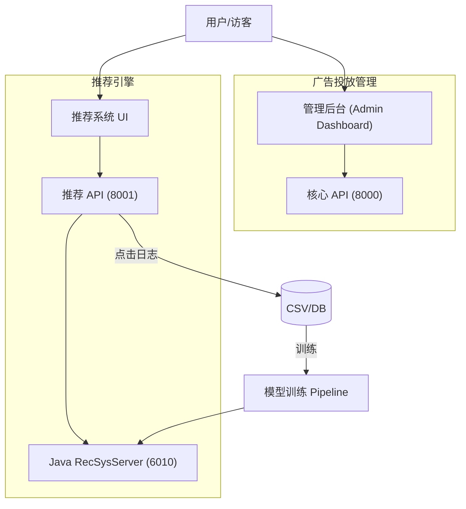

# GrowEngine 🚀

[](LICENSE)
[]()


**[English Documentation](README.md)**

GrowEngine 是一个全栈广告投放自动化平台，现已演进并集成了**混合推荐系统 (Hybrid Recommendation System)**。它结合了强大的广告计划管理看板与基于 SparrowRecSys 移植的实验性高性能推荐引擎。

## ✨ 核心功能

### 🏢 核心平台
- **📊 实时驾驶舱**：即时监控消耗、GMV、ROI 等核心投放指标。
- **📋 计划管理**：广告计划的全生命周期管理（创建、编辑、启停）。
- **🤖 智能诊断**：基于 AI 的广告效果优化建议。
- **🎮 竞价模拟**：基于 OnlineLp 算法策略的竞价仿真。

### 🎯 混合推荐系统 (新增)
与 **SparrowRecSys** 深度集成，采用"混合模式"架构：
- **Python 后端**：负责数据管理、特征工程及点击数据收集。
- **模型推理**：支持 Java RecSysServer 或 TensorFlow Serving 部署 NeuralCF, DeepFM, DIN 等模型。
- **交互式 UI**：专用的 React 前端，用于可视化推荐结果及追踪用户交互行为。

## 🏗 技术架构

GrowEngine 采用模块化架构：



## 📁 项目结构

```bash
ProtoAd/
├── frontend/          # 管理后台前端 (React + Vite + TailwindCSS)
├── backend/           # 核心广告管理 API (FastAPI)
├── ad_rec_frontend/   # 推荐系统展示 UI (React)
├── ad_rec_backend/    # 推荐 API、点击收集与数据管理
├── SparrowRecSys/     # 原始 Java 推荐引擎源码
├── web_visualization/ # 辅助可视化工具
├── scripts/           # DevOps 与实用脚本
└── docker-compose.yml # 全栈编排文件
```

## 🚀 快速开始

### 前置条件
- **Node.js** 18+
- **Python** 3.10+
- **Docker** (可选，用于一键部署)

### 💻 本地开发

#### 1. 核心平台 (投放管理)

**后端:**
```bash
cd backend
python -m venv venv
source venv/bin/activate
pip install -r requirements.txt
python generate_mock_data.py
uvicorn api:app --reload --port 8000
```

**前端:**
```bash
cd frontend
npm install
npm run dev
# 访问地址: http://localhost:5173
```

#### 2. 推荐系统模块

**推荐后端:**
```bash
cd ad_rec_backend
# 确保依赖已安装 (如果兼容可复用 backend 的 venv)
uvicorn api:app --reload --port 8001
```

**推荐前端:**
```bash
cd ad_rec_frontend
npm install
npm run dev
# 访问地址: http://localhost:3000 (具体端口请查看控制台)
```

## 🐳 Docker 部署

通过一条命令启动所有服务：

```bash
docker-compose up -d --build
```
这将启动：
- 核心后端
- 核心前端
- (取决于配置) 推荐系统相关服务

## 📡 API 文档

| 服务 | 基础 URL | 文档地址 |
|---------|----------|---------------|
| **核心 API** | `http://localhost:8000` | `/docs` |
| **推荐 API** | `http://localhost:8001` | `/docs` |

### 关键推荐接口
- `GET /api/rec/ads`: 获取个性化广告推荐。
- `GET /api/rec/similar`: 获取相似物品 (Item2Vec)。
- `POST /api/rec/click`: 记录用户点击交互事件。
- `POST /api/rec/train`: 触发模型重训练流水线。

## 📈 Star History

[](https://star-history.com/#huzhe01/adproto&Date)

## 🤝 贡献指南

欢迎参与贡献！
1. Fork 本项目
2. 创建特性分支 (`git checkout -b feature/AmazingFeature`)
3. 提交改动 (`git commit -m 'Add some AmazingFeature'`)
4. 推送到分支 (`git push origin feature/AmazingFeature`)
5. 提交 Pull Request

## 📄 开源协议

本项目基于 MIT 协议分发。详见 `LICENSE` 文件。
