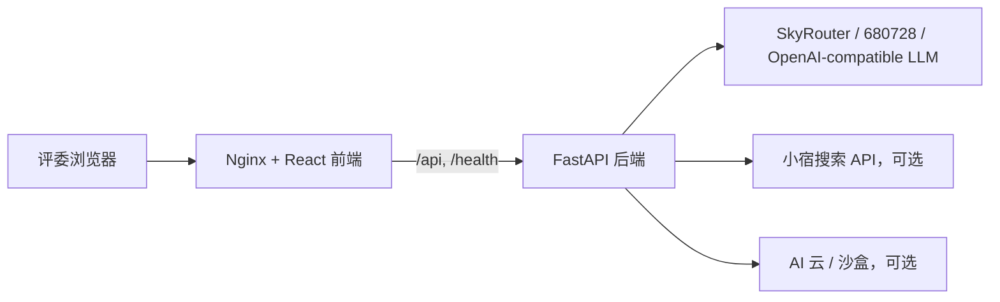

# GrowEngine 智投星 Agent 黑客松服务器部署教程

## 1. 背景和目标

比赛帖子强调，这类 Agent 黑客松更看重“企业真场景 + Agent 真执行 + 结果可衡量”，而不是简单聊天 UI。帖子也提到主办方资源可能包括小宿智能搜索、SkyRouter.ai 模型路由、AI 云/GPU 云/沙盒等 Agent Infra 能力。

因此本项目的部署目标是：

- 在自己的机器上可以开发和打包。
- 到比赛/主办方服务器后，只改环境变量即可启动。
- 模型路由、搜索、沙盒等资源通过 `.env.hackathon` 注入，不写死在代码里。
- 评委访问一个公网链接即可打开 Demo，前端通过同域 `/api` 调后端。

## 2. 推荐部署架构



关键设计：

- 前端容器只暴露一个公网端口，例如 `3000`。
- 前端静态资源由 Nginx 托管。
- Nginx 把 `/api/` 和 `/health` 代理到内部后端容器 `backend:8000`。
- 浏览器不需要知道后端容器地址，部署到临时服务器或公网隧道时更稳定。

## 3. 本地打包

在项目根目录执行：

```bash
chmod +x scripts/package-hackathon.sh
./scripts/package-hackathon.sh
```

脚本会生成：

```text
dist/growengine-agent-hackathon-YYYYMMDD-HHMMSS.tar.gz
```

压缩包会排除 `.git`、`node_modules`、Python 虚拟环境、构建缓存和真实 `.env.hackathon`，适合上传到比赛服务器。

默认生成的是核心 Demo 精简包，只包含：

- `frontend/`
- `backend/`
- `docker-compose.hackathon.yml`
- `.env.hackathon.example`
- `scripts/`
- `docs/`
- 根目录 README/License 等必要说明

移动端 APK、推荐系统大体量数据和历史可视化工具不进入默认压缩包。它们仍保留在源码仓库中，作为后续增强能力，不影响服务器一键跑通主 Demo。

## 4. 服务器启动

服务器需要 Docker 和 Docker Compose。上传压缩包后执行：

```bash
mkdir -p growengine-agent
tar -xzf growengine-agent-hackathon-*.tar.gz -C growengine-agent
cd growengine-agent

cp .env.hackathon.example .env.hackathon
```

编辑 `.env.hackathon`：

```bash
APP_PORT=3000
VITE_API_BASE_URL=

LLM_API_BASE=https://680728.xyz/v1
LLM_MODEL=qwen-max
LLM_API_KEY=替换为现场提供的模型 Key

XIAOSU_SEARCH_API_KEY=如果现场提供则填写
SKYROUTER_API_KEY=如果现场提供则填写
AI_SANDBOX_API_KEY=如果现场提供则填写
```

启动：

```bash
docker compose --env-file .env.hackathon -f docker-compose.hackathon.yml up -d --build
```

查看状态：

```bash
docker compose --env-file .env.hackathon -f docker-compose.hackathon.yml ps
docker compose --env-file .env.hackathon -f docker-compose.hackathon.yml logs -f backend
```

访问：

```text
http://服务器IP:3000
```

如果服务器有反向代理或公网域名，把域名指向 `APP_PORT` 即可。

## 5. 使用主办方资源的接入方式

### 5.1 SkyRouter / 模型路由

后端已经通过环境变量读取 OpenAI-compatible Chat Completions 配置：

- `LLM_API_BASE`
- `LLM_API_KEY`
- `LLM_MODEL`

如果现场提供 SkyRouter 或类似模型聚合服务，通常只需要把 `.env.hackathon` 中的这三项替换为现场值，然后重启后端：

```bash
docker compose --env-file .env.hackathon -f docker-compose.hackathon.yml up -d --build backend
```

当前代码位置：

- `backend/api.py`：`LLM_CONFIG`
- `backend/api.py`：`/api/ai/agent`

### 5.2 小宿智能搜索

当前 MVP 不强依赖搜索 API。若现场要求或有额度，可以把它作为加分工具接入：

- 在 `.env.hackathon` 填写 `XIAOSU_SEARCH_API_KEY`。
- 后端新增 `search_market_context` 或 `search_competitor_ads` 工具。
- Agent 在生成投放建议前，先搜索行业趋势、竞品素材、平台规则变化，再把来源写进报告。

适合 Demo 的搜索问题：

- “最近美妆礼盒投放有哪些热点？”
- “竞品在双 12 促销里主打什么卖点？”
- “平台近期广告审核规则有没有变化？”

### 5.3 AI 云 / 沙盒

沙盒资源可以用于异步任务或重型计算，但黑客松 MVP 不建议把主链路依赖在 GPU 上。推荐用法：

- 主 Demo 继续跑在 Docker Compose。
- 沙盒只做可选增强，例如批量生成竞品报告、素材评分、离线模拟。
- 如果沙盒不可用，Agent 仍可通过本地模拟数据完成诊断和执行闭环。

## 6. 开发实践建议

### 6.1 环境变量分层

不要把 Key 写入代码或 README。使用三层配置：

- `.env.hackathon.example`：提交到仓库，只放变量名和示例。
- `.env.hackathon`：本地或服务器真实配置，不提交。
- 平台控制台环境变量：如果部署到云平台，优先使用平台 Secrets。

### 6.2 单域名 API 策略

生产/比赛环境建议：

```text
VITE_API_BASE_URL=
```

这样前端请求 `/api/...`，Nginx 代理到后端。优点：

- 不需要处理浏览器 CORS。
- 公网只暴露一个端口。
- 临时服务器、内网穿透、反向代理都更容易。

本地开发仍可使用：

```text
VITE_API_BASE_URL=http://localhost:8000
```

### 6.3 Demo 稳定性

比赛现场优先保证固定演示路径：

1. 打开首页看到投放驾驶舱。
2. 打开“智投星 Agent”。
3. 输入“今天哪些计划需要处理？”
4. Agent 读取计划并输出诊断。
5. 输入“生成调优方案并模拟效果”。
6. 展示执行确认卡片。
7. 点击确认，计划表更新。
8. 输入“生成今日复盘报告”。

建议提前录一版备份视频，即使现场网络或模型服务波动，也能完整展示产品价值。

## 7. 常见问题

### Q1：前端打开后一直提示 API 不可用

检查容器：

```bash
docker compose --env-file .env.hackathon -f docker-compose.hackathon.yml ps
```

检查后端日志：

```bash
docker compose --env-file .env.hackathon -f docker-compose.hackathon.yml logs -f backend
```

检查浏览器访问：

```text
http://服务器IP:3000/health
```

正常应返回后端 JSON 健康状态。

### Q2：Agent 对话报 LLM 错误

优先检查 `.env.hackathon`：

- `LLM_API_BASE` 是否包含 `/v1`。
- `LLM_API_KEY` 是否正确。
- `LLM_MODEL` 是否是现场资源支持的模型名。

然后重建后端：

```bash
docker compose --env-file .env.hackathon -f docker-compose.hackathon.yml up -d --build backend
```

### Q3：服务器 3000 端口被占用

改 `.env.hackathon`：

```bash
APP_PORT=8080
```

重新启动：

```bash
docker compose --env-file .env.hackathon -f docker-compose.hackathon.yml up -d
```

### Q4：模型服务不稳定怎么办

保留三层 fallback：

- 前端固定 Demo 输入按钮。
- 后端已有关键词/模拟数据能力。
- 提前录制完整 Demo 视频。

路演时可以说明：真实生产环境会接入模型路由和限流重试；本次 Demo 重点验证企业投放 Agent 的闭环工作流。
